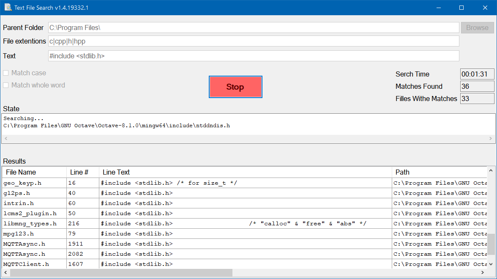

# Text File Search

### A Windows app that searches for text in simple text files.

The search is done on folders and sub-folders without recursion, instead I use an iterative approach and a stack to handle the subfolders in each folder.
I wrote this as a self exercise after I wrote the [File and Folder Search](https://github.com/EliAaron/FileAndFolderSearch) app.

The app is a WinForms application written in C# .NET.

